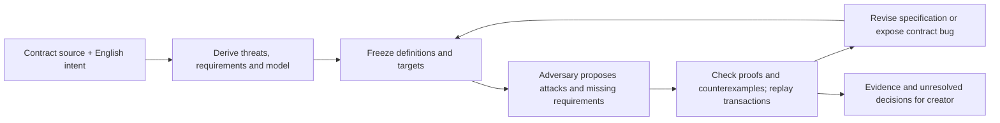

# General contract-and-intent pipeline

This extends the original escrow experiment with an agent-generated model and specification. New contract inputs use the same schemas, orchestration and checker; they do not need an escrow policy switch or a hand-written family reference model. The supported modeling language is deliberately small: pure Lean definitions, Std and a bounded number of security targets. Complicated contracts may produce an explicit unsupported or inconclusive result.

The product has **one adversarial revision loop**:



A missing requirement calls for a specification revision. A faithful specification that reveals a code bug should remain: the contract needs fixing. An incorrect model needs correction. An ambiguity needs a creator decision. The implementation records these distinctions rather than assuming every attack should disappear through a specification change.

## What is checked

- **Meaning:** an independent role sees the original contract and intent plus the actual Lean definitions and targets. It challenges omissions, assumptions, vacuity, quantifiers and boundaries. Its reasoning about English intent remains fallible, even when it supplies a formally checked model observation.
- **Target:** each review is bound to a digest containing the original input, model, statements, mapping, assumptions, toolchain and axiom policy. Proof attempts are excluded from that digest. Any meaning change creates a new snapshot. Comparator checks contributor targets and the definition closure against the protected challenge export. No editable definition holes are permitted; replaced model bodies are rejected, including the tested equivalent `n + 0` replacement.
- **Proof:** a zero-status Comparator result requires target comparison, permitted axioms and acceptance by Lean, NanoDa and con-ron. A compiling theorem declaration or a placeholder proof does not pass. Negated targets are generated by the harness, so a claimed counterexample must prove the exact frozen proposition's negation.
- **Concrete replay:** optional generic transaction traces execute the supplied Solidity source on a disposable localhost Anvil instance. The runner compiles the original source, sends transactions and records receipts and view return values. It does not execute adversary-authored test scripts. Traces are evidence for selected behavior, not a proof of model/EVM equivalence. No public chain or real wallet is used.

An observation of an omitted security property is separately labeled: it proves a fact about the model, while the argument that this fact violates English intent still needs review. Reasoning-only objections are unconfirmed. Earlier checked model attacks are replayed after revisions with their original propositions, and removed/changed requirements appear in the history. Failed replay is not automatically labeled a resolved contract bug. Concrete transaction replays are stored per finding. A new draft adds trusted operational requirement checks and accepted-case transaction regressions; see [DESIGN_HANDOFF.md](DESIGN_HANDOFF.md) for its commands, unit-test evidence and incomplete live verification.

Every run leaves `accepted: false`, `creator_approval: pending` and `contract_correspondence: not_proved`. This prototype does not assert comprehensive contract security.

## Set up and test

Requires Python 3.9+ and Docker. Build the pinned Lean 4.35.0-rc2 verifier; it downloads a large official Lean release on first build.

```sh
docker build -t auto-prove-verifier:lean4.35.0-rc2 general/verifier
python3 -m unittest test_general test_app test_engine
python3 -m general.regressions --output runs/reproduced-general-gates
```

The seven integration cases accept a real proof, reject `sorry`, reject a substituted target, reject a custom axiom, reject an equivalent model-body replacement, reject a meaning-changing definition and accept a genuine refutation of a false frozen target. These are verifier regression fixtures, not a measure of semantic specification quality.

For concrete replay, install [Foundry](https://github.com/foundry-rs/foundry) **1.7.1** and Solidity **0.8.28**. Put `anvil`, `cast` and `solc` on PATH, or set `AUTO_PROVE_ANVIL`, `AUTO_PROVE_CAST`, `AUTO_PROVE_SOLC` to their executable paths. The compiler uses `--no-import-callback`: external source imports and linked libraries need an explicit future input mechanism. The replay supports ordinary ABI signatures, constructor arguments, value transfers, direct calls and view observations; sophisticated attacker contracts and forked-chain scenarios are not yet supported.

```sh
python3 -m general replay general/fixtures/LendingPool.json \
  general/fixtures/lending-attack-trace.json --output runs/reproduced-lending-attack
```

This developer-authored transaction fixture demonstrates: fund the pool, deposit 100 wei, borrow 50 wei, withdraw 100 wei, and observe zero remaining collateral against 50 wei debt. It supplies a concrete contract bug example. It is not itself an AI-generated attack or proof that a specification is complete.

## Fresh model-generated specifications

Use your own authenticated Codex CLI (tested with 0.157.0), and choose a model available to that account. The commands send the input source and intent to your model provider. The original generalized experiments used `gpt-6-sol`; no account settings or credentials are included here.

```sh
python3 -m general run general/fixtures/LendingPool.json --rounds 2 \
  --model YOUR_AVAILABLE_MODEL --output runs/live-my-lending --evm
python3 -m general run general/fixtures/OwnerVault.json --rounds 2 \
  --model YOUR_AVAILABLE_MODEL --output runs/live-my-vault --evm
```

Omit `--evm` if Foundry/solc are unavailable. `--skip-checks` makes an explicitly unverified preview. Each role starts in an ephemeral context with shell tools, apps, plugins and MCP connectors disabled. The account's model settings otherwise apply. This is context separation, not an OS confidentiality boundary. Proof source is never executed on the host.

To introduce another contract, copy only the **input format**:

```json
{
  "id": "NewContract",
  "intent": "Creator's English requirements, including broad security goals",
  "contract_source": "pragma solidity ^0.8.28; contract NewContract { ... }",
  "approved_assumptions": []
}
```

Run it through the same command. The agent derives explicit requirements, threats and Lean definitions. Broad "make this secure" inputs must expose unresolved choices about actors, assets, trust and guarantees. Nothing about the schema certifies coverage of all Solidity constructs.

## Review and submit formal artifacts

```sh
python3 -m general freeze input.json candidate.json --output snapshot.json
python3 -m general verify snapshot.json Solution.lean --output runs/reproduced-my-proof
python3 -m general evidence snapshot.json finding.json --output runs/reproduced-my-attack
```

`verify` accepts arbitrary contributor-written Lean in a restricted container, but the protected snapshot is supplied by the trusted caller. Contributors cannot establish trust by supplying their own snapshot. Challenge files contain specification stubs with `by sorry`; these are targets, not claimed proofs. Solution `sorry` dependencies are rejected. The only permitted axioms are `propext`, `Quot.sound`, `Classical.choice`.

Compilation/export of the challenge, compilation/export of the solution, and adjudication use **three separate containers**. Each is non-root, network-free, read-only outside its disposable workspace, drops all capabilities, forbids gaining privileges and has process/CPU/memory/file-size/time limits. Only its own input and output directories are mounted; host credentials are never mounted. The adjudication container receives inert exports and protected Comparator configuration, never participant build configuration or source.

Docker Desktop cannot run Comparator's nested bubblewrap namespaces. Adjudication therefore explicitly uses upstream `--inadvisably-no-sandbox` **only inside the restricted outer container and only with both pre-generated exports**. Its upstream warning is preserved in logs. Never run that mode directly on the host or enable source compilation in the adjudication stage. The replacement isolation is supplied by the outer containers; it is not a claim that upstream bubblewrap ran. Export/source binding and protected target ownership are responsibilities of this harness.

## Yukon challenge scope

The solver should improve this general source-and-intent → specifications/attacks pipeline, rather than only prove a developer's already-fixed specification. Editable proposer/reviewer prompts give the first internal challenge a concrete submission surface. The harness, snapshot policy, checker and grading rubric must stay protected.

A prize leaderboard needs a meaningful evaluation corpus: previously unseen contracts, explicit creator security requirements, safe and unsafe variants, and a reviewed assessment of requirement coverage. Counting proved lemmas alone rewards trivial claims and misses the problem. An AI judge may help internal evaluation, but its coverage score is a provisional assessment, not a formal certificate. See [YUKON_CHALLENGE.md](YUKON_CHALLENGE.md) for the internal draft and launch gaps.

## Recorded generalization evidence

See [general/evidence/README.md](general/evidence/README.md) and its self-contained reports. The lending run has three independently checked target refutations and six agent-generated concrete replay records; it also retains failed proof attempts and unresolved lender requirements. The vault has six checked target proofs, a demonstrated abstraction limitation and a timed-out revision. The positive verdicts were independently rechecked after correcting the verifier's no-definition-hole policy. The 35 Python tests and seven checker regression cases pass. The internal semantic assessor and hosted benchmark account have not been validated/configured in these experiments.
